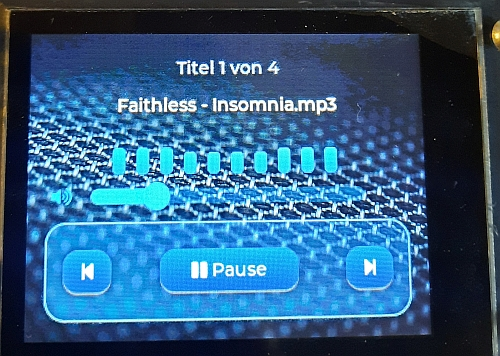

# ES3C28P

ESP32-S3 ES3C28P MODUL

Dies ist mein erstes Projekt mit diesem Modul. Es war eine schwierige Angelegenheit es zum laufen zu bekommen. Probleme verursachten im Touch und I2S Audio sowie SD-Card.

Nach ersten misslungenen Versuchen habe ich es dann doch geschafft und moechte es mit allen teilen die auch Probleme damit haben.

Achtung ! Dieses Modul erfordet LVGL 8.2.0

This is my first project using this module. Getting it up and running was a challenge; I encountered issues with the touchscreen, I2S audio, and the SD card.

After some initial failed attempts, I finally succeeded, and I would like to share the solution with anyone else facing similar problems.

\# Mein Audio Player 🎧

Hier ist ein Foto von meinem fertigen Projekt:

\## Features \& Funktionen

\* \*\* Anzahl der Titel:\*\* Automatische Erkennung und Anzeige der geladenen Tracks von der SD-Karte.

\* \*\* MP3-Name:\*\* Dynamischer Songtitel im Display (mit flüssiger Laufschrift).

\* \*\* Equalizer:\*\* Animierte, echtzeitnahe Frequenzbänder, passend zum Takt der Musik.

\## Steuerung (Buttons)

\* `Slider ` – Lautstärke

\* `<< Back` – Vorheriger Titel in der Playlist

\* `Play / Pause` – Musik anhalten und fortsetzen

\* `Forward >>` – Nächster Titel in der Playlist

\---

\*Created by Onkel Kaktus\* 🌵

